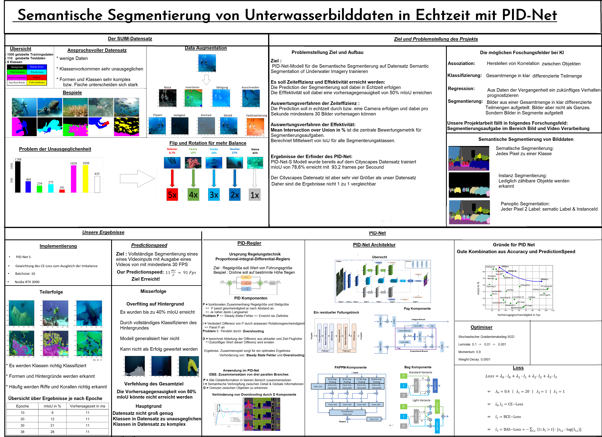

# RealTime Semantic Segmentation

## Bearbeitet von
- Ben Riegel (5178979)
- Fabian Schwickert (5455436)

## Verwendung

### Training 
Das Jupyter Notebook [RTSS.ipynb](/RTSS.ipynb) enthält den gesamten Quellcode für das Training eines PID-Net-S mit dem SUIM-Datensatz.
Um dieses Training selbst auszuführen, müssen nur alle Zellen des Jupyter-Notebooks ausgeführt werden.
In dem Ordner [Modelle](/Modelle) wird das Ergebnis der Trainings gespeichert. 

### Echtzeit-Test

In der Datei [video_transformer.py](/Video_Prediction/video_transform.py) befindet sich der Quellcode für das Testen des KNNs auf Echtzeitfähigkeit.
Mit dem Befehl

`python Video_Prediction Video_Prediction/exampleVideos/<Video> Modelle/<Modell>`

kann dieses Echtzeit-Testen ausgeführt werden. Dafür muss eine Grafikkarte verwendet werden.

### Eigenen Datensatz verwenden
Um einen eigenen Datensatz für das Training zu verwenden, müssen Parameter und die Datensatz-Klasse angepasst werden:
- Der Parameter `input_shape` muss bei einem anderen Bild-Format angepasst werden.
- Der Parameter `rgb2classes` muss für die Klassen des neuen Datensatzes angepasst werden.
- Die Funktionen `load_entries`, `load_entry` in der Klasse `RttsDataset` müssen angepasst werden.
Die Trainings- und Testdaten werden höchst wahrscheinlich in einer anderen Weise abgespeichert sein, als bei dem SUIM-Datensatz.
Zudem können die Labels in einer anderen Form vorliegen. 
- Das Training wurde mit einer Nvidia RTX 3090 und 32Gb RAM durchgeführt. Je nach verfügbarem Arbeits- und Grafikspeicher, muss die Batchsize beim Training reduziert werden. 

## Links
[vewendeter Datensatz](https://www.kaggle.com/datasets/ashish2001/semantic-segmentation-of-underwater-imagery-suim?select=train_val)

[Paper PIDNet](https://arxiv.org/pdf/2206.02066.pdf)

## Plakat
